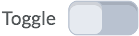

# d2l-switch

Polymer switch (toggle button) element, based on paper-toggle-button.




## Customization

```css
d2l-switch.colorful-custom-padding {
	--d2l-switch-padding: 1rem;
	--d2l-switch-toggle-label: {
		color: blue;
	};
	--d2l-switch-toggle-label-right: {
		color: green;
	};
	--d2l-switch-toggle-label-checked: {
		color: pink;
	};
}

d2l-switch.no-label {
	--d2l-switch-padding: 0;
	--d2l-switch-margin: 0;
}
```

## label-right attribute

Puts the label on the right for LTR languages, and on the left for RTL languages
```html
<d2l-switch label-right>Toggle</d2l-switch>
```

## Demo

To run the demo run `npm install`, `npm start` and visit http://localhost:9998/components/d2l-switch/demo/
